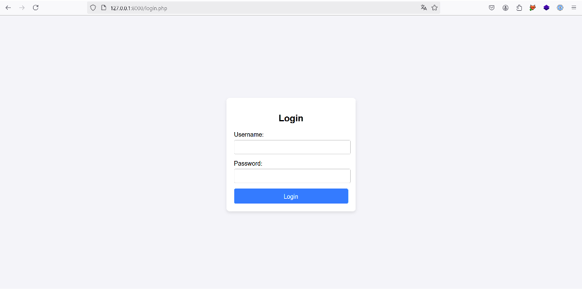
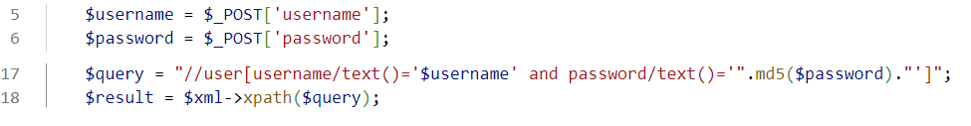
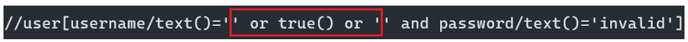
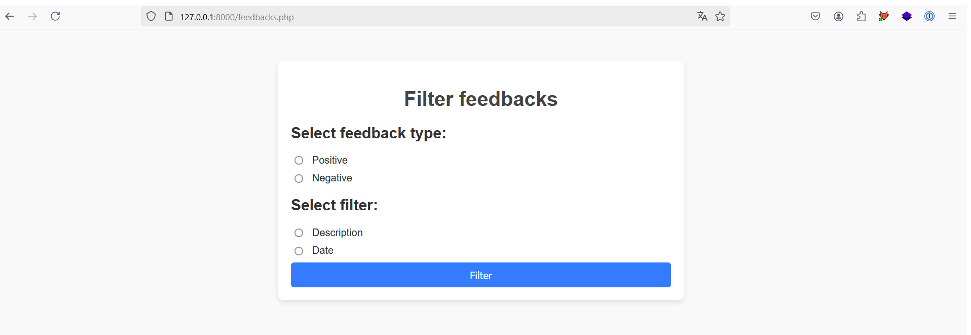
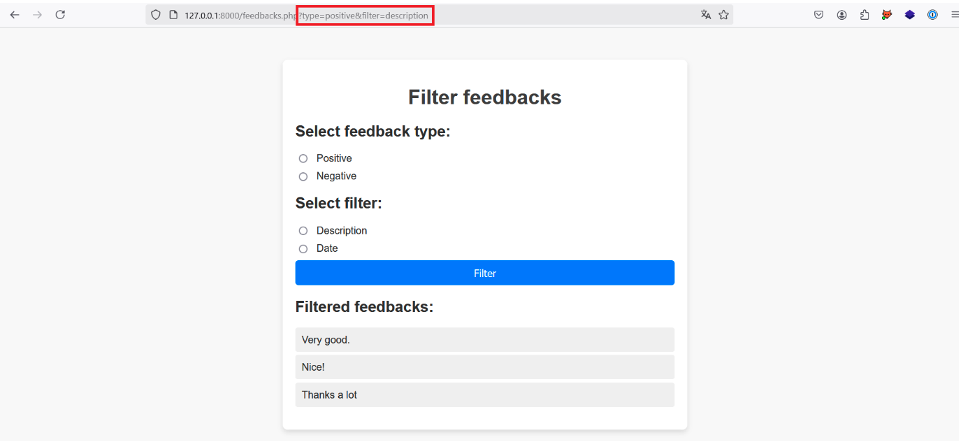
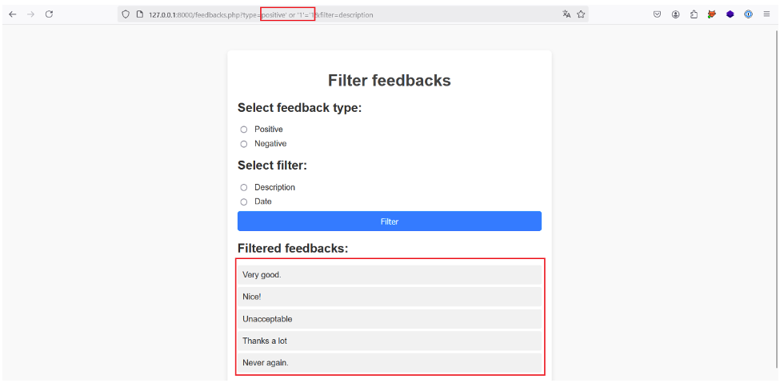

# X - Path

# Cấu Trúc Tài Liệu XML

XML (Extensible Markup Language) là một ngôn ngữ đánh dấu được tạo bởi W3C. Mục đích chính của XML là định nghĩa và lưu trữ dữ liệu để dễ dàng chia sẻ giữa các hệ thống máy tính khác nhau.

Một tài liệu XML được đặc trưng bởi một cấu trúc cây được định nghĩa rõ ràng. Ví dụ:

```xml
<?xml version="1.0" encoding="UTF-8"?>
<!-- List of product -->
<products>
    <product>
        <id>1</id>
        <name>Lamp</name>
        <price currency="USD">20.00</price>
    </product>
    <product>
        <id>2</id>
        <name>Fan</name>
        <price currency="USD">35.00</price>
    </product>
    <product>
        <id>3</id>
        <name>Pillow</name>
        <price currency="USD">15.00</price>
    </product>
</products>
```

Giải thích cấu trúc:

- Dòng đầu tiên của tài liệu XML chứa khai báo XML (XML declaration), xác định phiên bản sử dụng (trong trường hợp này là 1.0) và loại mã hóa ký tự (trong trường hợp này là UTF-8).

- Phần còn lại của tài liệu bao gồm các nút khác nhau (nodes). Trong XML, có nhiều loại nút, nhưng phổ biến nhất là:

    - Nút gốc (Root node): Đại diện cho toàn bộ tài liệu và chỉ có một nút con duy nhất.

    - Phần tử (Element): Có thể chứa văn bản, thuộc tính hoặc các phần tử khác. Trừ nút gốc, mỗi phần tử chỉ có một nút cha và có thể có một hoặc nhiều nút con.

    - Thuộc tính (Attribute): Cung cấp thông tin bổ sung cho một phần tử.

    - Văn bản (Text): Là nội dung của các phần tử.

    - Chú thích (Comment): Dùng để ghi chú tài liệu.

Những nút này tuân theo một cấu trúc cây phân cấp, trong đó mỗi nút có quan hệ cha-con, hoặc cả hai.

# XPath là gì?

XPath (XML Path Language) là một ngôn ngữ truy vấn, tương tự như SQL trong cơ sở dữ liệu quan hệ. XPath được sử dụng để truy xuất dữ liệu từ tài liệu XML và thường được kết hợp với các ngôn ngữ lập trình như PHP.

Dưới đây là một số yếu tố cơ bản trong cú pháp của XPath:

| Cú pháp |	Giải thích |
| ------- | ----------- |
| /  |	Chọn nút gốc (Root node) |
| // |	Chọn các nút con |
| . |	Chọn nút ngữ cảnh hiện tại (Context node) |
| .. |	Chọn nút cha |
| @attribut |	Chọn thuộc tính attribut |
| text() |	Chọn các nút văn bản |
| node() |	Chọn tất cả các nút |
| * |	Chọn tất cả các phần tử |
| @* |	Chọn tất cả các thuộc tính |
| \|	 | Để kết hợp các yêu cầu XPath |

Cú pháp này cho phép bạn tương tác với tài liệu XML và truy xuất thông tin tùy ý.

Có 1 số query khác nhau nhưng sẽ cho ra cùng kết quả, ví dụ:

| Mục tiêu | Truy vấn |
|--------- |----------|
| Chọn tất cả các phần tử product |	/products/product
|                                 | //product |
| Chọn tất cả các phần tử name |	/products/product/name |
|                              |    /products//name
|                              |    //product/name
|                              |    //name
|                              |    /*/*/name
| Chọn tất cả các thuộc tính   |  /products/product/price/@*
|                              |  /products//@*
|                              |  //@*
| Chọn tất cả thuộc tính currency |	/products/product/price/@currency
|                                 | /products/product//@currency
|                                 | //@currency
| Chọn tất cả các nút trong phần tử gốc |	/node()
| Chọn tất cả các nút |	//node()
Chọn tất cả các nút văn bản |	//text()
Chọn tất cả các nút phần tử |	//*
Chọn tất cả phần tử id và price |	`//id

# XPath Injection là gì?

XPath injection là một cuộc tấn công nhắm mục tiêu vào các ứng dụng sử dụng XPath để truy vấn cơ sở dữ liệu XML. Bằng cách chèn dữ liệu độc hại vào các trường nhập liệu của người dùng, kẻ tấn công có thể thao túng các truy vấn XPath do ứng dụng tạo ra.

Cuộc tấn công này cho phép kẻ xâm nhập:

- Truy cập dữ liệu nhạy cảm, hoặc

- Vượt qua các cơ chế xác thực.

# Bộ Lọc (Predicates) Trong XPath

Tương tự như từ khóa WHERE trong một truy vấn SQL, các bộ lọc (predicates) trong XPath có thể được sử dụng để lọc kết quả của một truy vấn XPath.

Bộ lọc được viết trong dấu ngoặc vuông `[ ]` và có thể bao gồm nhiều toán tử cũng như hàm để lấy kết quả cụ thể.

Các Toán Tử và Hàm Thường Dùng Trong Predicates:

|Toán tử/Hàm|	Mô tả|
|----------|--------|
| + |	Phép cộng 
|- |	Phép trừ 
|* |	Phép nhân
|div |	Phép chia
| = |	Bằng
| != |	Không bằng
| < |	Nhỏ hơn
| <= |	Nhỏ hơn hoặc bằng
| > |	Lớn hơn
| >= |	Lớn hơn hoặc bằng
| or |	Toán tử logic OR
| and |	Toán tử logic AND
| mod |	Lấy phần dư (Modulo)
| position() |	Vị trí của nút trong danh sách kết quả
| last() |	Số lượng phần tử trong chuỗi đang được xử lý
| true() |	Giá trị Boolean đúng
| contains() |	Tìm kiếm chuỗi ký tự con trong một chuỗi lớn hơn

Các toán tử này có thể được sử dụng để làm cho các truy vấn XPath phức tạp và chính xác hơn. Sau đây là một số ví dụ:

| Mục Tiêu |	Truy Vấn XPath |
|----------|-------------------|
|Chọn phần tử product đầu tiên |	//product[1]
|                              | //product[position()=1]
| Chọn phần tử product cuối cùng |	//product[last()]
| Chọn phần tử product có thuộc tính currency bằng 'GBP' |	//product/price[@currency='GBP']/..
|                                                      | //product/*[@currency='GBP']/..
| Chọn các phần tử product có id từ 1 đến 3 |	/products/product[id>1 and id<3]
| Chọn phần tử con thứ hai của phần tử cha thứ ba |	/products/product[3]/name
|                            | /products/product[3]/*[2]
|                            | /*/*[3]/*[2]

# Cách Nhận Diện và Khai Thác Lỗ Hổng XPath Injection

- Vượt qua xác thực (Authentication bypass).

- Hai phương pháp trích xuất dữ liệu trực tiếp (Direct data exfiltration).

- Trích xuất dữ liệu mù (Blind data exfiltration).

## Bypass authentication by XPath Injection

Hãy xem xét một trang đăng nhập như sau:



Có xml lưu trữ tài khoản người dùng:

```xml
<users>
    <user>
        <username>user1</username>
        <password>5f4dcc3b5aa765d61d8327deb882cf99</password>
    </user>
    <user>
        <username>user2</username>
        <password>7c6a180b36896a0a8c02787eeafb0e4c</password>
    </user>
    <user>
        <username>user3</username>
        <password>6b3a55e0261b0304143f805a2499aa8d</password>
    </user>
    <user>
        <username>admin</username>
        <password>21232f297a57a5a743894a0e4a801fc3</password>
    </user>
</users>
```

### Phát Hiện Lỗ Hổng XPath Injection Trong Mã Nguồn

Dưới đây là đoạn mã dễ bị tổn thương và truy vấn XPath được thực thi trên tài liệu XML khi người dùng cố gắng đăng nhập:



Truy vấn XPath trong dòng 17 bao gồm trực tiếp các giá trị người dùng nhập (username và password) mà không qua bước làm sạch (sanitization).

Điều này cho phép kẻ tấn công chèn mã độc vào truy vấn XPath thông qua các trường username hoặc password để vượt qua xác thực mà không cần một tên đăng nhập hoặc mật khẩu hợp lệ.

### Khai Thác Lỗ Hổng và Chiếm Quyền Tài Khoản Người Dùng

Để khai thác, kẻ tấn công phải ép buộc truy vấn trả về true. Điều này có thể được thực hiện bằng cách tiêm payload sau vào trường username: `' or true() or '`

Và nhập một mật khẩu tùy ý vào trường password.

Truy vấn XPath cuối cùng sẽ như sau:



Trong logic Boolean, truy vấn này tương đương với:

`false or true or false and false`

Kết quả luôn là true, cho phép vượt qua xác thực.

### Đánh Cắp Tài Khoản Quản Trị Viên Bằng XPath Injection

Sử Dụng Hàm position()

Payload sau sử dụng hàm position() để chọn một tài khoản cụ thể:

' or position()=1 '

Kẻ tấn công có thể tăng dần số thứ tự để lần lượt chọn từng người dùng trong tài liệu XML, hy vọng tìm thấy tài khoản mong muốn.

Trong trường hợp này, tài khoản quản trị viên nằm ở vị trí thứ 4 trong tài liệu XML. Kẻ tấn công có thể đánh cắp tài khoản này bằng cách tiêm payload:

`' or position()=4 '`

Sử Dụng Hàm contains()

Trong trường hợp tài liệu XML có hàng nghìn người dùng, phương pháp trên không khả thi.

Kẻ tấn công có thể sử dụng hàm contains() để tìm kiếm chuỗi ký tự trong tài liệu XML.

Ví dụ, payload sau tìm kiếm tài khoản có tên chứa chuỗi "admin":

`' or contains(., "admin") or '`

## Trích Xuất Dữ Liệu

Sau khi vượt qua xác thực, chúng ta có thể khai thác XPath injection để trích xuất dữ liệu nhạy cảm từ tài liệu XML. Cách tiếp cận này tương tự như kỹ thuật "union-based SQL injection".

###  Phương Pháp Cơ Bản



Ứng dụng này cho phép người dùng chọn loại phản hồi (feedback) và chọn mô tả hoặc ngày tháng của từng phản hồi.



Người dùng chọn nút Positive (Phản hồi tích cực) và Description (Mô tả), ứng dụng gửi yêu cầu HTTP GET với các tham số type=positive và filter=description đến máy chủ.

Giả sử dữ liệu được truy xuất bằng truy vấn XPath trong backend, truy vấn có thể triển khai như sau:

`/a/b/c[@d='$type']/$filter`

Trong đó:

- type là tham số positive hoặc negative.

- filter là tham số description hoặc date.

Các nút a, b, c và thuộc tính d không rõ ràng, nhưng có khả năng giá trị của các tham số type và filter được đưa vào truy vấn XPath như trên.

### Xác Định và Khai Thác Lỗ Hổng XPath Injection

Để xác định xem tham số type có dễ bị XPath injection hay không, thử tiêm payload sau:

positive' or '1'='1

Giữ nguyên tham số filter=description.

Truy vấn cuối cùng sẽ như sau:

/a/b/c[@d='positive' or '1'='1']/description

Điều kiện '1'='1' luôn đúng, do đó tất cả các mô tả của các nút c (bao gồm cả phản hồi tích cực và tiêu cực) được trả về.



Chứng tỏ lỗ hổng XPath injection tồn tại.

### Trích Xuất Dữ Liệu Khác

Để trích xuất dữ liệu khác ngoài các mô tả phản hồi, chúng ta kiểm tra xem tham số filter có dễ bị khai thác XPath injection hay không.

Nếu giá trị của tham số filter được đặt ở cuối truy vấn XPath, chúng ta có thể chèn payload | //text() để truy xuất tất cả các nút văn bản trong tài liệu XML.

Payload: `| //text()`

Truy Vấn XPath Cuối Cùng: `/a/b/c[@d='random']/random|//text()`


