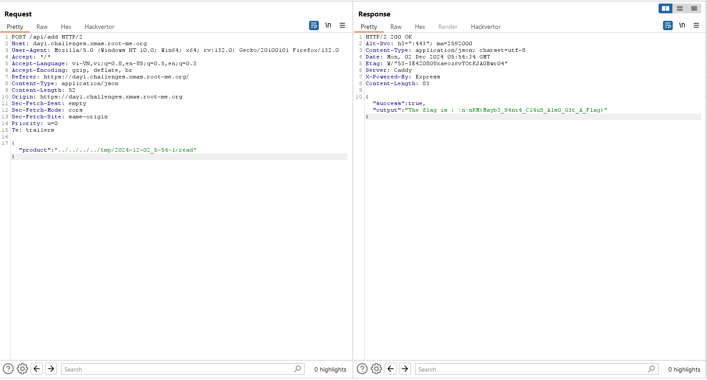

## 

## WEB

Bài này có source code, bạn có thể tải về và build theo hướng dẫn trong đó

Đầu tiên ta đánh hơi thấy lỗ hổng Path Traversal, và cần phải prove nó: 

Thành công với việc dùng `../` để di chuyển qua lại, ta xem đoạn code của đoạn này: 

Vậy ta thử để đọc file `flag.txt` nhưng báo lỗi nhận lại thông báo là nó ko phải 1 module: 

Quay lại với tính năng upload file, mình đã nghĩ đến việc tải lên 1 file và dùng path traversal để add lung tung nhưng không được: 

Và bây giờ kết hợp 2 tính năng lại, mình nghĩ đến việc tải lên `tmp/`  file `js` đóng vai trò là module và để đọc file flag.txt

Và truy xuất: 

Lần này tạo hàm và xuất module: 

Vậy là nó đọc được chỉ là đang sai path

Chốt hạ :

Còn đây là với server thực: 

Ta có flag: 

Game : 

Crypto: 

